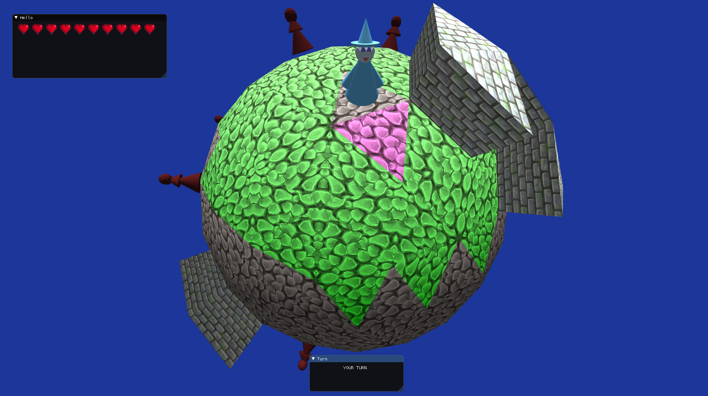
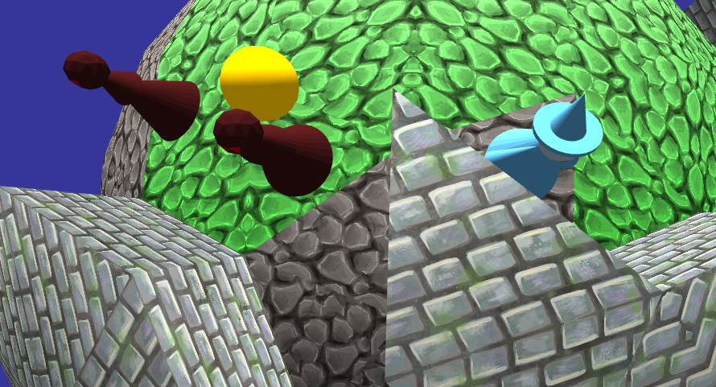

# Geoglobe: A small 3D roguelike using the [AGL2.0](https://github.com/DPAttila/AGL2.0) graphics library.

A turn-based game on an (ico-) spherical procedurally generated map of triangular tiles.

